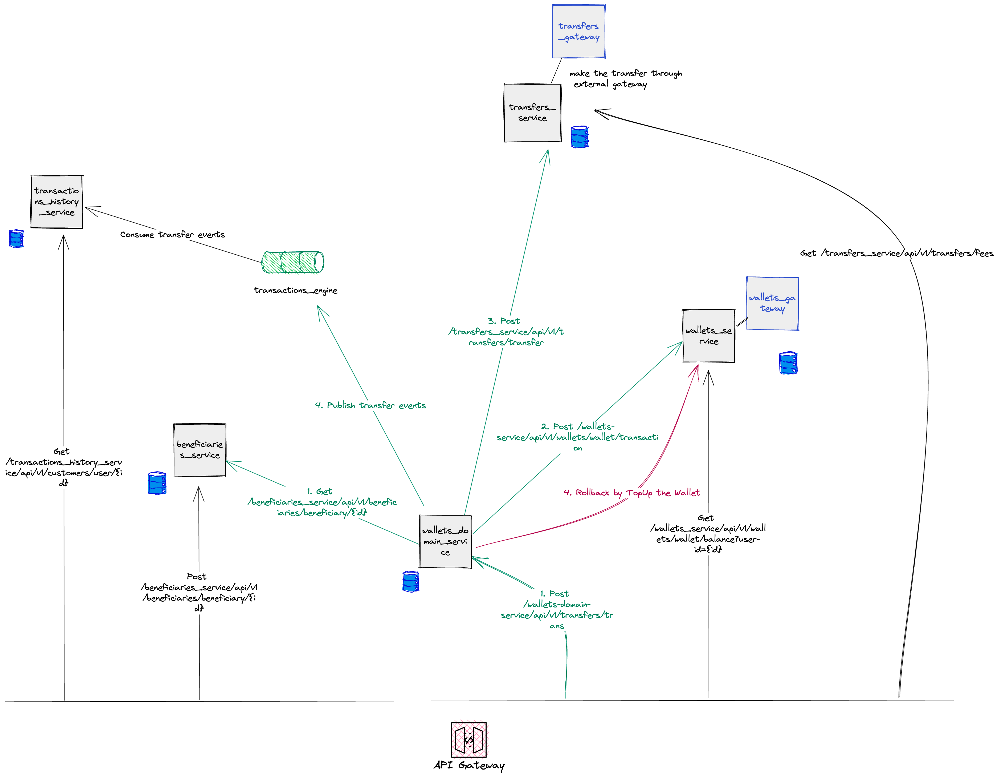
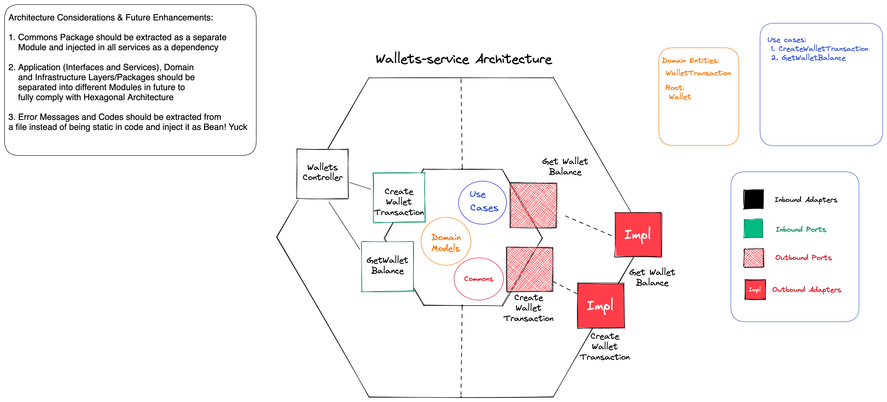

# wallet_system

wallet_system project which is developed in microservices architecture with SAGA Design Pattern
and coded with hexagonal architecture. Consisting of:  
- transfers_service
- wallets_service
- beneficiaries_service
- wallets_domain_service (Orchestrator)

## Design Decisions and Challenges
As a Financial System usually needs to have a lot of integrations with multiple
vendors. It's recommended to use Microservices Architecture for the following: 

- Provide decent level
of isolation and less dependency on the external systems. Example: Change on Bank's side in regard to provided transfer API. Only change
is required in <b> transfers_service</b>
- Separate and independent Deployments which leads to high availability

## High Level Architecture

## Low Level Architecture

## Future Improvements
- Swagger (API Documentations) to be used
- Spring Validations should be added and violations handled
- Kafka integration should be added in wallets_domain_service and events to be published in case of transfer full flow success
- SonarQube to be used
- Commons Module to be extracted and injected as a dependency in all services
- Logging interceptor to be used for requests logging needed for a search engine such as ELK

## Requirements

- Java 17
- Spring Boot 3+
- Maven

## Run
The repository contains 4 services following are the steps you need to run each:  
- To run all services check that all the ports in application.yaml are available in your machine otherwise change the ports in the files
- To run beneficiaries_service make sure that you have instance up and running of Postgresql with credentials mentioned in application.yaml (or change them according to your database connection string). Along with database named <b>beneficiaries-service</b>

## API catalog
The repository contain a postman collection.
